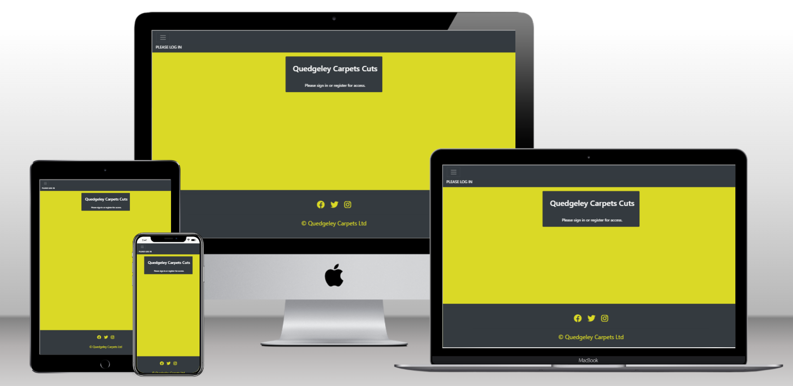
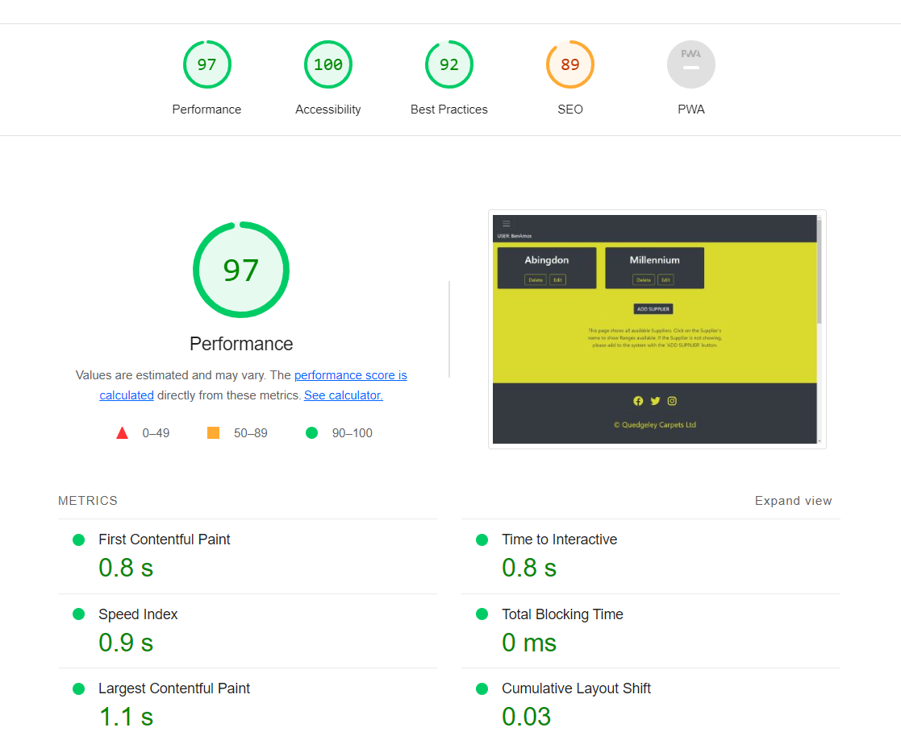

# Quedgeley Carpets Cuts

https://qc-cuts.herokuapp.com/

# Purpose

Due to growing business, and recent purchase of new warehouse space. Quedgeley Carpets needed a way to know what stock
they have stored at the warehouse, how much of that stock had been sold, and how much they have left to sell. Also this
information would need to be available to be accessed in multiple environments, Shop, Warehouse and out on site.

The purpose of Quedgeley Carpets Cuts is to allow the user a platform to control the stock in the warehouse, help the
sales team to ensure they are selling items that are in stock, and show when stock needs to be reordered. Most of this will
be done using CRUD functionality.

## Create
Create instances of Suppliers, Ranges, Rolls and Cuts, including all relevant data that is required for each item.
## Read
Pull this information, so that the user can see the data linked to a particular item. i.e Suppliers, or Ranges that are linked 
to a particular Supplier. Also to be able to manipulate this data to bring back relevant information for the user. i.e An overall
roll balance for a particular roll.
## Update
Allow the user to update the data that has already been created. i.e Customer changes their cut size, or a Roll has been delivered short.
## Delete
Allows the user to delete data that is no longer required. i.e Rolls that have been completely sold, and all cuts have been taken from it.

# Database Schema

Before coding could be started, we needed to look at the how the Database would look. How tables would link to one and another and how the data would flow from one to another. This is where the Database Schema comes is, as a visual tool to show all of this. Also showing the Primary and Foreign Keys linking the tables.

From the image above, you can see the tables flow from one to another, from Supplier - Range - Roll - Cut. The Foreign Key in the each table is the Primary Key from the previous (exlcuding Supplier, as this is the first table). With this set, we can now start to look at how we would develop the site.

# Agile

Along with the Database Schema, the site was developed using an Agile approach. This was done by looking at the site overall and creating user stories stating the issue we would like to solve, and how it would benefit the user. This was done using GitHub's Projects.

https://github.com/users/benamos216/projects/3

The issues was some functionality that the site would provide. We then worked based upon these issues, ensuring the code that was being written had some relevance to the one of the User Stories. As a User Story was worked through, it was placed in 'In Progress' and the 'Done' once the functionality was there for the user.

These stories were also split into 'Must Have' & 'If have time'. 'Must Have' meant we had to include them into the site, to ensure the it did as the user expected. The 'If have time' are additional functionality, and would only be done if there was time to include them without affecting the overall performance and functionality of the site.

# Wireframes

A basic design was made up to show how the site would be laid out and look to the overall user. There are 2 wireframes created, Desktop and Mobile. As most pages would follow the same design, to keep it simplistic and allows the user to follow the flow, there was only one wireframe made of each, the only changes would be the 'cards' themselves, hence why the cards have different information on them.

Main colour scheme based on the company's own colours,

- Nav & Footer - #3433AF
- Main Body - #DAD926
- Text Colour - White

## Desktop Wireframe

## Mobile Wireframe

# User Responsiveness

Image of how the site will look on different platforms, from Desktop to Mobile.

# Lighthouse Performance

We used Google's Chrome built in Lighthouse Report to measure the performance of the site. This was measured for both Desktop and Mobile use. As you'll see from the images below, for the Desktop lighthouse scored well on most sections apart from the SEO, where there could be improvement made, although this is not a necessity fro this site. With the Mobile lighthouse it again scored well on most areas, with SEO being the poorest score of them all.

# Validation

To ensure correct methods of coding was followed, several validation test were carried out.

Firstly all pages from the site were passed through https://validator.w3.org/ to check HTML coding. Due to Python coding, direct page source had to be taken from each rendered page. Initially we were advised to add a language within the HTML tag, as well as warned about having a 'Button' within a 'Span'. These have now been corrected and as such all pages have been checked and show no warnings or errors.

Secondly CSS for the site was passed through https://jigsaw.w3.org/css-validator/. Orginally it came back with a duplication of Background color for the buttons when hovered over. Also found that the 'card-body' had a float set to auto, when not required. These have been corrected, and as such no errors are now showing.

Thirdly, usually we would've used PEP8online to validate our Python code. Since this site doesn't appear to be functioning at present, we have used Pycodestyle with Gitpod to check code. This allowed for errors to be displayed as Problems in a separate window within the coding environment. As a result, these errors were fixed as and when they arose when coding. Generally, these errors would be missing whitespaces, extra whitespaces, invalid syntax or line too long.

# Frameworks, Libraries & Dependancies

The following packages were used to create this project.

### Django 3.2
[Python web framework](https://www.djangoproject.com/)

### Psychopg 2
[Python PostgreSQL adapater](https://pypi.org/project/psycopg2/)

### Gunicorn
[Python WSGI HTTP server](https://gunicorn.org/)

### dj-database-url
[Django utility to create an environment variable to configure the Django application](https://pypi.org/project/dj-database-url/)

### Django-allauth
[User account management django application suite](https://django-allauth.readthedocs.io/en/latest/overview.html)

### Cloudinary and django-cloudinary-storage
Libraries to enable storage of static files and media in Cloudinary

https://cloudinary.com/

https://pypi.org/project/django-cloudinary-storage/

### Bootstrap 4.6.2
[Front end CSS and JavaScript library](https://getbootstrap.com/)

# Features

- Nav Bar -
A simple Nav Bar was used, using the Bootstrap's 'Burger' Icon, allowing the user to do a few operations, such as Login/Signup, Return to Home Page, Login as Admin or Logout. It will also show the user that is logged in at the time.

- Signup/Login -
We used 'Allauth' for user signup and login. Again this is a simple system, as all that is required is a Username and Password to register for use on the site.

- Create -
Using Django's builtin forms, again a simple form was added to allow the user to input data. It will only show the fields that the user is allowed to add to at that time.

- Edit -
Again uses Django's builtin forms, it is just a copy of the 'Add' forms, again only allowed the user to edit the data on certain fields.

- Roll Balance -
One of the functions that was required from the site, was to calculate the remaining balance of a roll. This is done by a simple calculation upon clicking the 'Roll Balance' button. From the images below, the initial remain balance is '20m', this is because the roll is 25m in length and there is currently one cut allocated against the roll, for the length of 5m. So 25m-5m=20m. Now when we allocate a new cut, with the length of 3m, and then click on the 'Roll Balance' button, the remaining balance is updated to 17m, 25m-5m-3m. This allows for a user to see if there is sufficient stock to allocate a cut to, or if they need to order in an additional roll.

- Cut -
Another function that was required, was a way of marking that an allocated cut had been actioned. As you can see from the image below, we have 3 cuts allocated. The first is yet to be cut, and has a 'Cut?' button next to it. Once a user has actioned a Cut, they click the button, and then the Cut is updated as Cut, with Date and User who actioned it. As shown with the second and third Cut in the image.

- Incorrect Input -
While filling out the forms, either to add or edit an item, only correct inputs will be allowed. If they do try to input something that they cannot, a prompt will come up to let the user know that they have entered and incorrect item.

- Messages -
Every time the user actions something within the site, a message will be displayed in the top right corner of the screen. This is set to display for 3 seconds and then remove itself. This allows the user to track what they have just done, but doesn't distract them as it clears itself.

- Delete Warning -
If the user wants to delete an item from the Database, they will be prompted with a warning. This will ask the user if they are sure they want to delete the item, and make them choose between Okay or Cancel. This will help to prevent the user from deleting an item by accident.

- Admin -
There is a main admin page that can be used to directly access Database items and Users. Only anyone with Admin credentials can access, and will be made to sign in. Once in they can view each of the Database tables and the items within it. As well as this they can edit, delete and add new items to Database. Also they can view Users who registered to the site for access, and again remove user who are no longer required to have access.

## Future Features

As shown in the GitHub Project, there are 2 items that were not implemented due to time constraints and ensuring the necessary features were prioritised first. They are as follows,

- Search - Allow the user to search for Supplier, Range, Roll or Cut without having to Navigate through the pages. This would be take a single piece of Data and return results that are related to it. For example, a Customer Invoice could be searched, and any cuts related to that customer would be displayed.

- Rem List - Once a Roll has sufficient cuts allocated to it, and no more cuts are likely to fit within the Roll Balance, the Roll would be deleted once all cuts have been marked as cut. When the user goes to delete the roll, the remaining balance would be added to a new list, of rolls to become Remnants. A user would be able to pull the list and print it, to be able to create these rem's.

# Testing

Features and functionality of the site were tested by using Manual and Automated tests.

- Manual Testing - All CRUD functionality was testing to ensure it complete as expected. This required Creating, Editing and Deleting Data from each one of the models that was created. When entering data, false entries were made to check that only correct inputs would be allowed, and a prompt would be displayed to let the user know. Pages were checked to ensure they loaded as should, in correct order. Buttons, working as they should, loading correct page, or performing the correct function. Messages, show what has been actioned and with the correct message. 

- Automated - Django's built in Unit Testing was used to perform automated testing. Testing was done our models and views to ensure they worked correctly. At this current time coverage provides 82% overall testing on the code, with 100% for our Models and 65% on Views. Due to time constraints, we were not able to continue performing Unit Testing on Form validation, Toggle Cut and Calc Function, however these were extensively tested manually to ensure if performed as expected. Also, time permitting we would've used Pytest instead, however it wasn't brought to our attention in time for us to convert over and continue testing.

# Bugs

Several issues arose during the course of this project, causing bugs and errors as a result. The main ones were as following,

- Roll Balance Calculation - initially we had problems retrieving the required data from 2 Models at once to perform the calculation. Data that was being pulled, was for all cuts or rolls, this was being caused by aggregating the data into one total. Once we had annotated through the data, creating data related to the relevant Roll ID, we then had issues iterating over the data to the correct item. At this point it was just pulling the first item for both Roll Size and the Sum of Cuts. We then had to filter over the Queryset by roll_id, this then produced a new Queryset with 1 result in, by which we could call by its index of 0. As a result, we can now pull the correct Roll Size and Sum of Cuts related to each relevant roll by its ID.

- Migrations - during the course of the project, it was noticed that some of the models had been initially set up incorrectly. When these were corrected, and migrations were made as part of the standard process. When making these migrations, an error was brought up, and not creating the migrations. As a result, one of the Models was not accessable from the Database/Admin panel. Issue was raised on Slack, and it was suggested to clear previous migrations off the system, and re run. This allowed for the migrations to go through and all Models were again showing on the Database and Admin panel.

- Redirects - originally redirects when adding or editing an item was to redirect back to the page the user was on previously. This was being problematic to complete, and threw back errors. As a result the user is taken back to the main page, this is a minor inconvenience, and something that would be looked at in the future developement.

# Deployment

Quedgeley Carpets Cuts is deployed to Heroku, using an ElephantSQL Postgres database.
To duplicate deployment to Heroku, follow these steps:

- Fork or clone this repository in GitHub.
- You will need a Cloudinary account to host user images and static files.
- Login to Cloudinary.
- Select the 'dashboard' option.
- Copy the value of the 'API Environment variable' from the part starting `cloudinary://` to the end. You may need to select the eye icon to view the full environment variable. Paste this value somewhere for safe keeping as you will need it shortly (but destroy after deployment).
- Log in to Heroku.
- Select 'Create new app' from the 'New' menu at the top right.
- Enter a name for the app and select the appropriate region.
- Select 'Create app'.
- Select 'Settings' from the menu at the top.
- Login to ElephantSQL.
- Click 'Create new instance' on the dashboard.
- Name the 'plan' and select the 'Tiny Turtle (free)' plan.
- Select 'select region'.
- Choose the nearest data centre to your location.
- Click 'Review'.
- Go to the ElephantSQL dashboard and click on the 'database instance name' for this project.
- Copy the ElephantSQL database URL to your clipboard (this starts with `postgres://`).
- Return to the Heroku dashboard.
- Select the 'settings' tab.
- Locate the 'reveal config vars' link and select.
- Enter the following config var names and values:
    - `CLOUDINARY_URL`: *your cloudinary URL as obtained above*
    - `DATABASE_URL`: *your ElephantSQL postgres database URL as obtained above*
    - `PORT`: `8000`
    - `SECRET_KEY`: *your secret key*
- Select the 'Deploy' tab at the top.
- Select 'GitHub' and confirm you wish to deploy using GitHub. You may be asked to enter your GitHub password.
- Find the 'Connect to GitHub' section and use the search box to locate your repo.
- Select 'Connect' when found.
- Optionally choose the main branch under 'Automatic Deploys' and select 'Enable Automatic Deploys' if you wish your deployed site to be automatically redeployed every time you push changes to GitHub.
- Find the 'Manual Deploy' section, choose 'main' as the branch to deploy and select 'Deploy Branch'.
- Your site will shortly be deployed and you will be given a link to the deployed site when the process is complete.

# Credits

We would to acknowledge the following for inspiration, guidance and resources;

- Code Institutes - Django-Blog, for Django implementation, and deployment with Heroku. As well as set-up with additional frameworks/libraries such as Cloudinary and Allauth.

- Code Institutes - Hello-Django, for function based views, saving and updating forms and toggle function.

- Stackoverflow - used for troubleshooting ideas and problems with code, especially with the Roll Balance calculator, how to work with queryset's and using the correct function with it.

- Andy Guttridge - for his overall help and guidance with issues that were posted within the Slack app. Everytime, I could count on Andy to come up with an idea/guide to help come with a solution with any issue that was encountered.