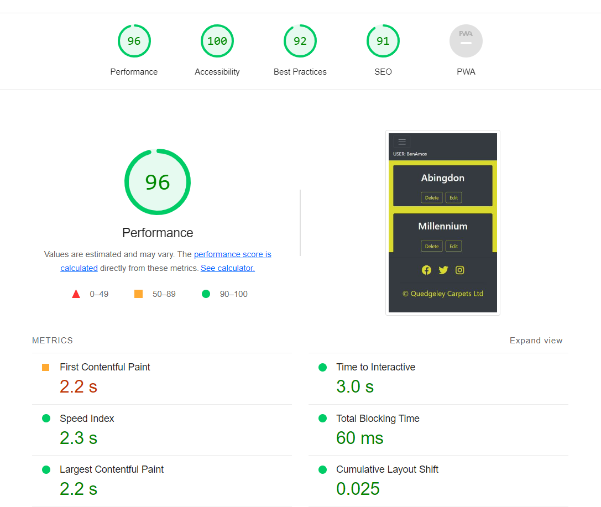

# Quedgeley Carpets Cuts

https://qc-cuts.herokuapp.com/

# Purpose

Due to growing business, and recent purchase of new warehouse space. Quedgeley Carpets needed a way to know what stock
they have stored at the warehouse, how much of that stock had been sold, and how much they have left to sell. Also this
information would need to be available to be accessed in multiple environments, Shop, Warehouse and out on site.

The purpose of Quedgeley Carpets Cuts is to allow the user a platform to control the stock in the warehouse, help the
sales team to ensure they are selling items that are in stock, and show when stock needs to be reordered. Most of this will
be done using CRUD functionality.

## Create
Create instances of Suppliers, Ranges, Rolls and Cuts, including all relevant data that is required for each item.
## Read
Pull this information, so that the user can see the data linked to a particular item. i.e Suppliers, or Ranges that are linked 
to a particular Supplier. Also to be able to manipulate this data to bring back relevant information for the user. i.e An overall
roll balance for a particular roll.
## Update
Allow the user to update the data that has already been created. i.e Customer changes their cut size, or a Roll has been delivered short.
## Delete
Allows the user to delete data that is no longer required. i.e Rolls that have been completely sold, and all cuts have been taken from it.

# Database Schema

Before coding could be started, we needed to look at the how the Database would look. How tables would link to one and another and how the data would flow from one to another. This is where the Database Schema comes is, as a visual tool to show all of this. Also showing the Primary and Foreign Keys linking the tables.

<!-- link to database image -->

From the image above, you can see the tables flow from one to another, from Supplier - Range - Roll - Cut. The Foreign Key in the each table is the Primary Key from the previous (exlcuding Supplier, as this is the first table). With this set, we can now start to look at how we would develop the site.

# Agile

Along with the Database Schema, the site was developed using an Agile approach. This was done by looking at the site overall and creating user stories stating the issue we would like to solve, and how it would benefit the user. This was done using GitHub's Projects.

https://github.com/users/benamos216/projects/3

The issues was some functionality that the site would provide. We then worked based upon these issues, ensuring the code that was being written had some relevance to the one of the User Stories. As a User Story was worked through, it was placed in 'In Progress' and the 'Done' once the functionality was there for the user.

These stories were also split into 'Must Have' & 'If have time'. 'Must Have' meant we had to include them into the site, to ensure the it did as the user expected. The 'If have time' are additional functionality, and would only be done if there was time to include them without affecting the overall performance and functionality of the site.

# Wireframes

A basic design was made up to show how the site would be laid out and look to the overall user. There are 2 wireframes created, Desktop and Mobile. As most pages would follow the same design, to keep it simplistic and allows the user to follow the flow, there was only one wireframe made of each, the only changes would be the 'cards' themselves, hence why the cards have different information on them.

Main colour scheme based on the company's own colours,

- Nav & Footer - #3433AF
- Main Body - #DAD926
- Text Colour - White

## Desktop Wireframe

## Mobile Wireframe

# User Responsiveness

<!-- IMAGE OF AIREPONSIVENESS -->

# Lighthouse Performance

<!-- images of lighthouse-->

# Frameworks, Libraries & Dependancies

### Django 3.2
[Python web framework](https://www.djangoproject.com/)

### Psychopg 2
[Python PostgreSQL adapater](https://pypi.org/project/psycopg2/)

### Gunicorn
[Python WSGI HTTP server](https://gunicorn.org/)

### dj-database-url
[Django utility to create an environment variable to configure the Django application](https://pypi.org/project/dj-database-url/)

### Django-allauth
[User account management django application suite](https://django-allauth.readthedocs.io/en/latest/overview.html)

### Cloudinary and django-cloudinary-storage
Libraries to enable storage of static files and media in Cloudinary

https://cloudinary.com/

https://pypi.org/project/django-cloudinary-storage/

### Bootstrap 4.6.2
[Front end CSS and JavaScript library](https://getbootstrap.com/)

The following packages were used to create this project.

# Features

Signup/Login
Create
Edit
Delete
Roll Balance
Cut
Messages
Delete Warning#
Admin

## Future Features

As shown in the GitHub Project, there are 2 items that were not implemented due to time constraints and ensuring the necessary features were prioritised first. They are as follows,

- Search - Allow the user to search for Supplier, Range, Roll or Cut without having to Navigate through the pages. This would be take a single piece of Data and return results that are related to it. For example, a Customer Invoice could be searched, and any cuts related to that customer would be displayed.

- Rem List - Once a Roll has sufficient cuts allocated to it, and no more cuts are likely to fit within the Roll Balance, the Roll would be deleted once all cuts have been marked as cut. When the user goes to delete the roll, the remaining balance would be added to a new list, of rolls to become Remnants. A user would be able to pull the list and print it, to be able to create these rem's.

# Testing

- Manual
- Automated
 <!-- Image of coverage report -->

# Bugs

Several issues arose during the course of this project, causing bugs and errors as a result. The main ones were as following,

- Roll Balance Calculation - initially we had problems retrieving the required data from 2 Models at once to perform the calculation. Data that was being pulled, was for all cuts or rolls, this was being caused by aggregating the data into one total. Once we had annotated through the data, creating data related to the relevant Roll ID, we then had issues iterating over the data to the correct item. At this point it was just pulling the first item for both Roll Size and the Sum of Cuts. We then had to filter over the Queryset by roll_id, this then produced a new Queryset with 1 result in, by which we could call by its index of 0. As a result, we can now pull the correct Roll Size and Sum of Cuts related to each relevant roll by its ID.

- Migrations - during the course of the project, it was noticed that some of the models had been initially set up incorrectly. When these were corrected, and migrations were made as part of the standard process. When making these migrations, an error was brought up, and not creating the migrations. As a result, one of the Models was not accessable from the Database/Admin panel. Issue was raised on Slack, and it was suggested to clear previous migrations off the system, and re run. This allowed for the migrations to go through and all Models were again showing on the Database and Admin panel.

- Redirects - originally redirects when adding or editing an item was to redirect back to the page the user was on previously. This was being problematic to complete, and threw back errors. As a result the user is taken back to the main page, this is a minor inconvenience, and something that would be looked at in the future developement.

# Deployment

# Credits

Hello-Django
Django-Blog

Slack
Andy